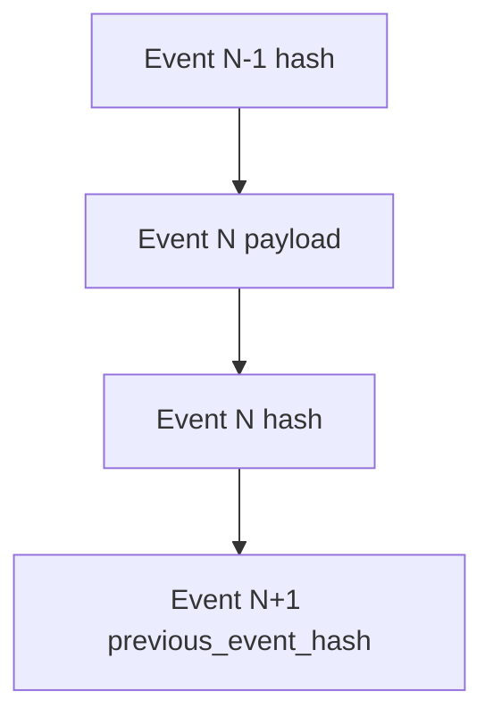

# Audit and Provenance Engine

## Purpose

Establish end-to-end evidence for what was ingested, where it came from, how it changed, and whether records were tampered with.

## Provenance Layers

1. Source provenance: provider/source/path/device identifiers
2. Identity provenance: hash + canonical ID + version lineage
3. Event provenance: append-only event logs with chain links
4. Operational provenance: sync state, errors, retries, reconciliation outputs
5. Conversational provenance: canonical message ingestion, classification, and ranking traces

## Immutable History Model

- `FileVersion` nodes are immutable.
- New content state creates a new version node.
- `parent_version_id` defines lineage direction.

## Verification and Replay

Replay process:
1. load event stream in order
2. recompute event hash per record
3. verify chain links
4. reconstruct canonical/version state
5. compare against persisted state

## Tamper-Evidence Guarantees

- hash mismatch indicates content mutation
- chain mismatch indicates event sequence mutation
- missing link indicates truncation or deletion
- duplicate event IDs indicate replay abuse

## Recommended Audit Queries

- Show all versions for canonical ID
- Show all provider path transitions for source_id
- Verify forensic chain for session_id
- Report all reconciliation mismatches in a window
- Trace message-to-idea extraction lineage and ranking inputs

## Replay Scope Extension

Replay should cover:
- file/content ingestion events
- DesktopCam audit chain events
- message ingestion and classification events
- ranking engine outputs with explainability metadata
