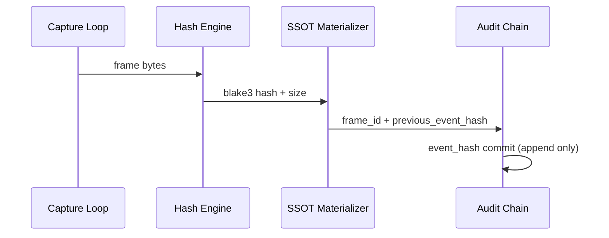

# DesktopCam Forensic Recorder

## Objective

Provide immutable, chain-verifiable screen capture events suitable for forensic review.

## Recorder Design

- Capture interval: configurable (1-10 FPS)
- Each frame:
  - UUID7 timestamp marker
  - BLAKE3 digest
  - canonical/version materialization
- Each event links to previous event hash

## Append-Only Audit Schema

### audit_event

| Field | Description |
|---|---|
| event_id (UUID7) | event key |
| timestamp_uuid7 | event timestamp identity |
| blake3_hash | frame content digest |
| frame_id | linked captured frame |
| previous_event_hash | chain link |
| event_hash | cryptographic event digest |

Immutability controls:
- no updates
- no deletes
- trigger-enforced append-only behavior

Reference migration:
- `sql/003_semantic_desktopcam.sql`

Event hash payload recommendation:
- `timestamp_uuid7`
- `blake3_hash`
- `frame_id`
- `previous_event_hash`

## APIs

- `start_desktopcam()`
- `stop_desktopcam()`
- `verify_event_chain()`
- `export_forensic_bundle()`

## Crash Resilience

- immediate event flush hook
- restart-safe chain verification
- partial sequence recovery by longest valid prefix
- per-event fsync/flush hook in recorder pipeline

## Forensic Bundle Format

Recommended bundle contents:
- session metadata
- frame manifest
- audit event chain
- verification report
- hash manifest

## Court-Admissibility Considerations

- deterministic hash algorithms documented
- immutable log controls demonstrable
- full chain verification reproducible
- key management and storage access logging auditable
- clock synchronization policy documented

## Test Plan

- event-chain integrity tests (valid/invalid chain)
- crash mid-capture and recovery-prefix tests
- append-only DB trigger enforcement tests
- deterministic forensic bundle export validation

## Rationale and Tradeoffs

- Immediate flush improves forensic durability with write-latency overhead.
- Append-only tables reduce mutation risk but increase storage requirements.
- Strict chain verification improves trust at cost of verification runtime for long sessions.
