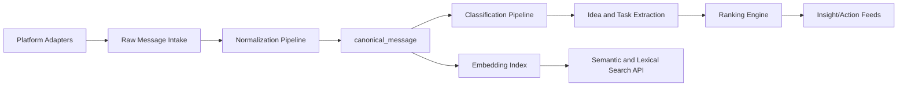

# Global Chat Ingestion Layer

## Status

Planned module (architecture complete, implementation staged).

## Goal

Ingest enterprise knowledge from conversational systems into SSOT as normalized, queryable, and auditable message records.

Supported platforms (adapter-based):
- ChatGPT
- Claude
- Copilot
- Perplexity
- Notion AI
- Slack
- Discord
- Email

## Architecture

## Canonical Message Schema

### canonical_message

| Field | Type | Description |
|---|---|---|
| message_id | UUID7 | Stable message identity |
| source_platform | text | platform identifier |
| source_workspace | text | tenant/workspace id |
| source_channel | text | channel/thread/mailbox |
| source_message_id | text | provider-native message id |
| author_id | text | source user id |
| author_display | text | optional display name |
| role | text | user/assistant/system/tool |
| body_text | text | normalized plaintext body |
| body_markdown | text | optional preserved markdown |
| body_hash_blake3 | text | normalized body digest |
| created_at | timestamptz | source timestamp |
| ingested_at | timestamptz | ssot ingest timestamp |
| metadata | jsonb | platform-specific extras |

### canonical_message_classification

| Field | Type |
|---|---|
| message_id | UUID |
| topic | text |
| intent | text |
| domain | text |
| confidence | float |
| labels | text[] |

### idea_candidate

| Field | Type |
|---|---|
| idea_id | UUID7 |
| message_id | UUID |
| title | text |
| summary | text |
| feasibility_score | float |
| impact_score | float |
| novelty_score | float |
| ranking_score | float |
| extracted_at | timestamptz |

### canonical_message_embedding

| Field | Type |
|---|---|
| message_id | UUID |
| embedding_model | text |
| embedding_vector | double precision[] |
| embedded_at | timestamptz |

## Adapter Contract

Every platform adapter must output:
- source platform identifiers
- message metadata
- normalized textual content
- deterministic source key for idempotency

Adapter guarantees:
- replay-safe upserts
- pagination support
- cursor checkpointing
- bounded retry/backoff

## Classification and Extraction Pipeline

1. Normalize text and metadata.
2. Classify message by topic, intent, and domain.
3. Extract action items, ideas, and insights.
4. Rank candidates by feasibility, impact, novelty.
5. Store explainability metadata for each score.

## Ranking Engine

Final ranking score formula (example):

$$
score = 0.40 * feasibility + 0.40 * impact + 0.20 * novelty
$$

Design constraints:
- deterministic inputs and explainable outputs
- pluggable scoring model
- versioned ranking policy

## Search Interface

### Query Modes

- Exact lexical search
- Semantic vector search
- Hybrid search with reranking

### API Contracts

- `POST /chat/search` (query, filters, mode, limit)
- `GET /chat/messages/{message_id}`
- `GET /chat/ideas?min_score=...`
- `POST /chat/reindex_embeddings`

## Integration with SSOT Core

- Message body hashes use BLAKE3 for tamper-evident identity.
- Message/object IDs use UUID7 for sortable lineage.
- Classification and idea extraction events can be mirrored into provenance logs.
- Semantic layer can share embedding infrastructure and vector search contracts.

## Edge Cases

- edited/deleted source messages
- thread context split across pagination windows
- bot/system messages without stable author identity
- duplicate content across channels/platforms
- private content requiring tenant-level access filtering

## Test Plan

- Adapter contract tests per platform
- Normalization idempotency tests
- Cursor resume and retry tests
- Classification precision/recall benchmark set
- Ranking stability and explainability tests
- Search relevance and latency tests

## Rationale and Tradeoffs

- Canonical schema creates a stable integration contract at cost of adapter complexity.
- Hybrid search increases relevance at cost of infrastructure overhead.
- Model-agnostic interfaces preserve portability while allowing local or cloud inference backends.
