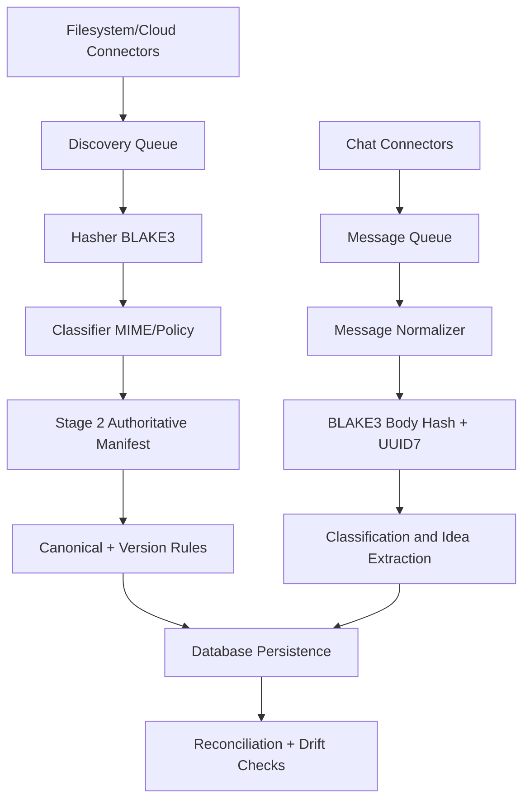

# Ingestion Pipeline

## Scope

Defines the end-to-end ingestion path from crawlers/connectors into canonical identity, lineage, and indexed storage.

## Pipeline Stages

1. Discovery and crawl
2. Hashing and classification
3. Manifest/index generation
4. Canonical/version/materialization
5. Provider delta reconciliation
6. Rolling reconciliation and repair
7. Chat/message ingestion and semantic indexing

## Connector Model

Supported connector categories:
- Local/server filesystems
- Google Drive
- Dropbox
- OneDrive
- Email attachments
- Social/media archives
- External drives
- Chat and collaboration platforms

Each connector must emit normalized records:
- provider_id
- source_id
- path
- mtime
- size
- mime_type
- optional cursor metadata

## Delta Sync Logic

- Full sync when no cursor is present
- Incremental sync when cursor is available
- Event types: new, moved, renamed, modified, deleted
- Retry/backoff policy should be connector-specific but contract-compatible
- Chat adapters use equivalent event classes: new, edited, deleted, thread-merged, metadata-updated

## Rolling Reconciliation Strategy

- Compare provider snapshot against SSOT state periodically
- Record mismatches:
  - missing in provider
  - missing in SSOT
  - hash mismatch
- Trigger bounded remediation jobs rather than global reindex

## Resource Throttling

Idle-time scanning recommendations:
- Reduce scanning priority under active user workload
- Allocate IO budget windows per source
- Cap concurrent hash workers
- Pause non-critical semantic jobs during ingest spikes

## Crash Recovery

Recovery primitives:
- checkpoint files per stage
- append-only event/audit streams
- idempotent replay of uncommitted deltas
- startup reconciliation pass
- cursor and watermark durability for chat ingestion adapters

Edge cases:
- source file disappears between discovery and hash
- permission changes mid-run
- connector cursor invalidation
- partial stage output with stale checkpoint

## Integration Notes

- Stage 2 manifest is authoritative for ingestion handoff.
- Stage 3 enriches but does not redefine Stage 2 identity decisions.
- Semantic and DesktopCam modules plug in after canonical/version materialization.
- Global Chat Ingestion plugs in through canonical message normalization and can share semantic infrastructure for vector search.

## Global Chat Ingestion Adapter Matrix

| Adapter | Sync Type | Cursor Strategy | Primary Key |
|---|---|---|---|
| ChatGPT export/import | batch + incremental | export watermark | source_message_id |
| Claude export/import | batch + incremental | export watermark | source_message_id |
| Copilot logs/connectors | incremental | event cursor | source_message_id |
| Perplexity export | batch | snapshot id | source_message_id |
| Notion AI workspace | incremental | page cursor + timestamp | source_message_id |
| Slack | incremental | channel cursor | ts/thread_ts |
| Discord | incremental | message id cursor | message id |
| Email | incremental | UID/Message-ID | message-id |
