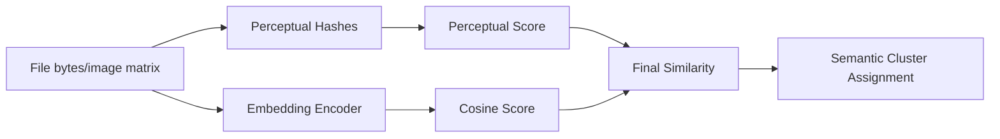

# Semantic Intelligence Layer

## Objective

Identify semantically related content even when binary hashes differ.

Examples:
- Cropped/resized images of the same scene
- PDF exports of the same source document
- Similar screenshots captured over time
- Near-duplicate DesktopCam frames

## Feature Stack

1. Perceptual hashes:
- aHash
- dHash
- pHash

2. Embeddings:
- CLIP-compatible embedding interface
- model-agnostic embedding provider contract

3. Similarity scoring:
- cosine(embedding)
- perceptual hamming-normalized similarity
- weighted final score

## Data Model

### semantic_cluster

| Field | Type | Notes |
|---|---|---|
| cluster_id | UUID7 | cluster key |
| canonical_file_ids | UUID[] | members by canonical ID |
| similarity_scores | JSONB | pairwise map |
| representative_embedding | float[] | centroid/mean vector |
| created_at | timestamptz | creation timestamp |
| updated_at | timestamptz | update timestamp |

### semantic_membership (recommended bridge)

| Field | Type |
|---|---|
| cluster_id | UUID |
| file_id | UUID |
| canonical_file_id | UUID |
| similarity_score | float |

## APIs

- `find_semantically_similar_files(file_id)`
- `cluster_new_file(file_id)`
- `rebuild_semantic_clusters()`

### API Contract Notes

Input contract:
- `file_id` must map to canonical/version context.
- fingerprints must include perceptual hashes and embedding vector.

Output contract:
- scores must be normalized to `[0, 1]`.
- cluster membership must be reproducible for same input set and threshold.

## Integration with Canonical/Version

- Canonical identity remains BLAKE3-based.
- Semantic groups are orthogonal metadata overlays.
- Semantic updates must not mutate historical `file_version` lineage.

## Edge Cases

- Visually similar but legally distinct documents
- Thumbnail artifacts causing false positives
- Embedding drift after model replacement
- Multi-language OCR-heavy PDFs with shared layout

## Operational Controls

- configurable similarity threshold
- top-k candidate cap
- background rebuild windows
- deterministic fallback model for low-resource deployments

## SQL Integration

Reference migration:
- `sql/003_semantic_desktopcam.sql`

## Test Plan

- perceptual hash correctness on synthetic fixtures
- cosine similarity numeric stability checks
- cluster determinism under repeated runs
- threshold boundary tests around cluster inclusion
- performance profiling for large fingerprint sets

## Rationale and Tradeoffs

- Weighted perceptual + embedding score improves recall but can increase compute cost.
- Model-agnostic embedding contract preserves portability at the cost of adapter complexity.
- Cluster rebuild is deterministic but may be expensive at large scale without batching.
