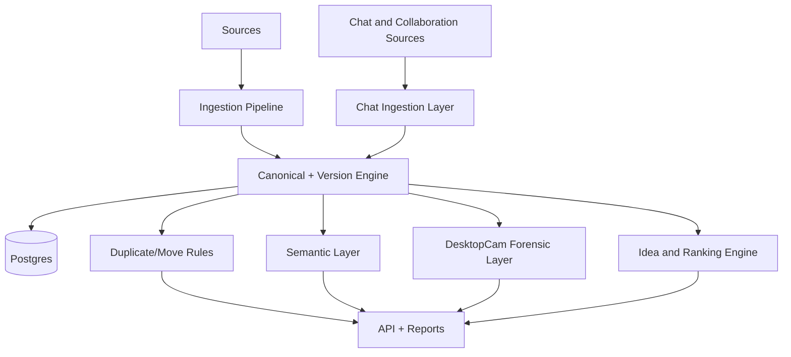

# Technical Whitepaper

## Abstract

The SSOT platform provides deterministic digital object identity, immutable lineage tracking, and extensible intelligence modules for enterprise content governance.

## Problem Statement

Distributed content ecosystems create duplication, uncertain ownership, weak provenance, and high compliance risk.

## Approach

- canonical identity from BLAKE3 + UUID7
- strict version lineage and immutable event semantics
- cross-provider synchronization and reconciliation
- extensible semantic and forensic overlays
- normalized conversational ingestion with ranking and search

## System Architecture

## Technical Differentiators

- hash-first identity model
- deterministic rule layer (`ssot_core`)
- append-only forensic chain capability
- model-agnostic semantic interface
- platform-agnostic chat normalization and ranking pipeline

## Risk Controls

- staged ingestion with checkpoint recovery
- reconciliation loops and drift detection
- append-only audit constraints
- deterministic replay paths for verification

## Extensibility

- new providers via normalized connector contract
- embedding provider swaps without schema redesign
- tenant-scoped deployment patterns
