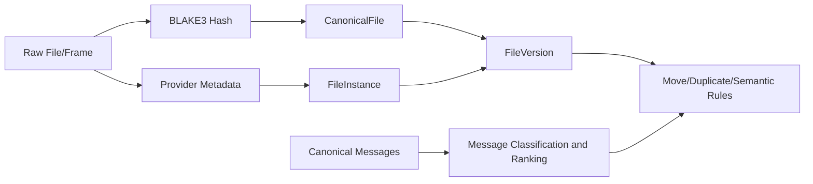
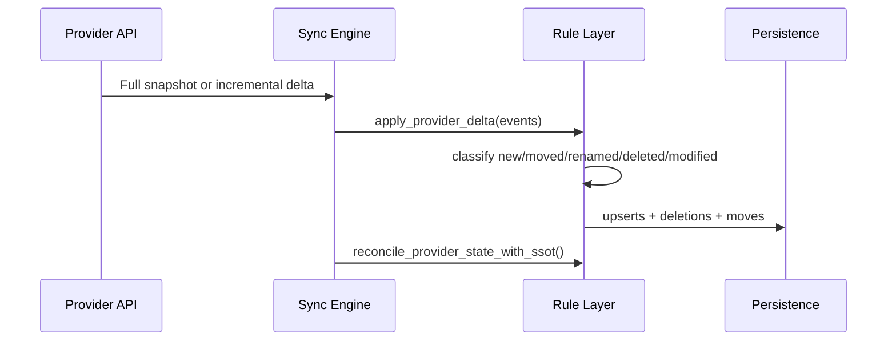

# SSOT Core Architecture

## Purpose

`ssot_core` is the deterministic decision layer for identity, lineage, duplicate handling, provider reconciliation, semantic clustering, forensic event chaining, and future chat-message normalization integration.

## Core Identity Model

- Content identity: `BLAKE3` digest + byte size
- Object identity: `UUID7`
- Location identity: `(provider, source_id, path, device_id)`

## Versioning and Lineage Rules

| Condition | Classification | Action |
|---|---|---|
| Same hash+size, different path/provider | same version, new location | Add/refresh `FileInstance` |
| Different hash, same path/provider | new version | Create child `FileVersion` |
| Different hash, different path/provider | new canonical object | Create new `CanonicalFile` |

Lineage fields:
- `canonical_id`
- `version_id`
- `parent_version_id`
- `created_at`

## Duplicate Detection Logic

- Primary key: `blake3_hash`
- Secondary guards: `size`, `mime_type`
- Group output: `DuplicateGroup` with instance IDs, provider distribution, and paths.

## Move Detection Logic

Rules:
- Same hash, old path missing, new path appears: **move**
- Same hash, old path remains, new path appears: **copy**

Cross-boundary support:
- provider-to-provider
- device-to-device
- path-only rename in same provider

## Provider Sync Architecture

## Event Classification Rules

- `new`: source_id first seen
- `moved`: same source_id/hash, path changed
- `renamed`: moved within same logical parent context
- `modified`: source_id exists, hash changed
- `deleted`: source_id removed upstream

## Data Model Summary

| Entity | Responsibility |
|---|---|
| `CanonicalFile` | Stable content identity namespace |
| `FileVersion` | Immutable version node in lineage |
| `FileInstance` | Provider/path observation |
| `ProviderSyncState` | Cursor and sync health |
| `DuplicateGroup` | Duplicate cluster by hash/size/mime |
| `MoveEvent` | Move/copy event record |
| `SemanticCluster` | Near-duplicate semantic grouping |
| `AuditEvent` | Append-only forensic event chain |
| `CanonicalMessage` (planned) | Normalized cross-platform message object |
| `IdeaCandidate` (planned) | Extracted/ranked idea artifact from chat corpus |

## Integration Points

- Ingestion pipeline writes normalized records, then calls rule functions.
- API layer can expose read-only views from rule outputs.
- Persistence layer remains replaceable; `ssot_core` stays storage-agnostic.
- Global chat ingestion adapters can use the same identity/lineage and semantic contracts via `UUID7` IDs and BLAKE3 body hashes.

## API Contract Surface (Current and Planned)

Current:
- versioning: `classify_version_change`, `link_version_lineage`
- duplicates: `find_duplicates_for_hash`, `unify_duplicates_into_canonical`, `report_duplicate_groups`
- provider sync: `sync_provider`, `apply_provider_delta`, `reconcile_provider_state_with_ssot`
- move detection: `detect_moves`, `update_paths_for_moves`, `log_move_events_for_audit`
- semantic layer: `find_semantically_similar_files`, `cluster_new_file`, `rebuild_semantic_clusters`
- forensic layer: `start_desktopcam`, `stop_desktopcam`, `verify_event_chain`, `export_forensic_bundle`

Planned:
- chat ingestion/query: normalized message upsert, classification extractors, ranking/retrieval interfaces

## Replaceability and Auditability

- Pure-function rule modules for deterministic behavior
- Explicit dataclasses for serialization and replay
- No dependency on any assistant or model vendor
